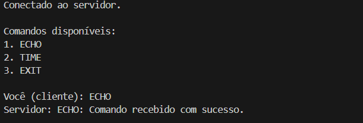
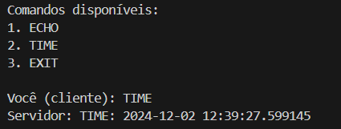
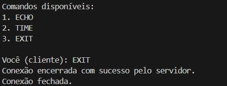
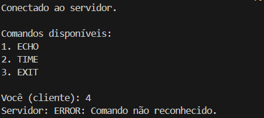
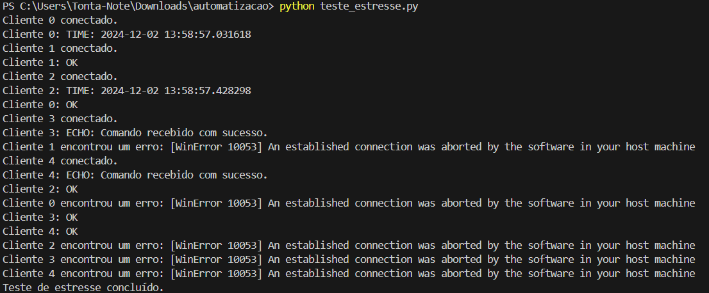

# 🌐 Sistema Cliente-Servidor TCP

Este projeto implementa um sistema de comunicação cliente-servidor utilizando o protocolo TCP. O sistema permite que clientes enviem comandos ao servidor, que processa e responde com base no comando recebido. O projeto foi desenvolvido como parte de um desafio acadêmico para aprimorar as funcionalidades de um sistema básico de comunicação.

---

## 👤 Integrante

|    **[Maria Antônia](https://github.com/mariaantoniadev)** |
| :---: |

---

## ✨ Funcionalidades

### 🖥️ Servidor
- **📋 Comandos Suportados:**
  - 🪞 `ECHO`: Retorna uma mensagem de confirmação ao cliente.
  - ⏰ `TIME`: Envia a data e hora atuais ao cliente.
  - ❌ `EXIT`: Encerra a conexão com o cliente.
  - ❓ Qualquer outro comando é respondido com uma mensagem de erro.

- **👥 Gerenciamento de Clientes:**
  - Suporte a múltiplos clientes conectados simultaneamente usando threads.
  - Encerramento automático de conexões inativas ou inesperadas.

- **📜 Log de Atividades:**
  - Registra eventos como conexões, mensagens recebidas, comandos processados e desconexões em um arquivo `server_log.txt`.

### 📱 Cliente
- **🛠️ Menu de Comandos:**
  - Lista os comandos disponíveis para o usuário.

- **🔄 Reconexão Automática:**
  - Caso o cliente perca a conexão, ele tenta se reconectar automaticamente ao servidor.

- **💬 Comunicação Interativa:**
  - O cliente envia comandos e recebe respostas em tempo real.

---

## 🛠️ Arquitetura do Sistema

O sistema é baseado na comunicação via **sockets** no protocolo TCP:
1. **Servidor**: Escuta conexões de clientes na porta especificada e cria uma thread dedicada para cada cliente.
2. **Cliente**: Conecta-se ao servidor e envia comandos por meio de uma interface de linha de comando.

---

## ⚙️ Pré-Requisitos

- Python 3.x
- Biblioteca padrão do Python (não são necessárias dependências externas)

---

## 🚀 Como Usar

### Passo 1: Inicializar o Servidor
1. Execute o arquivo `servidor.py`.
2. O servidor começará a escutar conexões na porta especificada (padrão: `5000`).

### Passo 2: Conectar um Cliente
1. Execute o arquivo `cliente.py`.
2. O cliente tentará se conectar ao servidor automaticamente.
3. Uma vez conectado, o menu de comandos será exibido.

---

## ✅ Testes

### 📋 Casos de Teste
#### 📢 **Comando ECHO**
1. No cliente, envie o comando `ECHO`.
2. Verifique se o servidor retorna a mensagem de confirmação.
3. **Imagem de Teste:**
   

#### ⏰ **Comando TIME**
1. No cliente, envie o comando `TIME`.
2. Verifique se o servidor retorna a data e hora atuais.
3. **Imagem de Teste:**
   

#### ❌ **Comando EXIT**
1. No cliente, envie o comando `EXIT`.
2. Verifique se a conexão é encerrada no cliente e no servidor.
3. **Imagem de Teste:**
   

#### ❓ **Comando Inválido**
1. No cliente, envie um comando inexistente.
2. Verifique se o servidor retorna a mensagem de erro.
3. **Imagem de Teste:**
   

#### 📈 **Testes de Estresse**
1. Conecte múltiplos clientes simultaneamente ao servidor.
2. Envie uma grande quantidade de mensagens rapidamente para verificar a robustez do sistema.
3. **Imagem de Teste:**
   

---

### 📝 Resultados Esperados
| 🧪 Caso de Teste   | 🏁 Resultado Esperado                                                   | ✅ Status  |
|--------------------|------------------------------------------------------------------------|-----------|
| 📢 Comando ECHO    | O servidor retorna "ECHO: Comando recebido com sucesso."              | [✔️]       |
| ⏰ Comando TIME    | O servidor retorna a data e hora no formato correto.                  | [✔️]       |
| ❌ Comando EXIT    | A conexão é encerrada corretamente no cliente e servidor.             | [✔️]       |
| ❓ Comando Inválido| O servidor retorna "ERROR: Comando não reconhecido."                  | [✔️]       |
| 📈 Testes de Estresse | O sistema continua responsivo e sem erros com múltiplos clientes. | [❓]       |

---

## 🧩 Desafios e Soluções

- **⚙️ Manuseio de Múltiplos Clientes:** Utilizou-se threads para gerenciar conexões simultâneas.
- **🔄 Reconexão Automática:** Foi implementada no cliente uma lógica para reconectar em caso de falha.
- **📜 Registros e Logs:** Foi integrado um sistema de logs para monitorar as atividades do servidor.
- **❌ Erro WinError 10053 - Conexão Abortada pelo Software:** Durante os testes de estresse, o erro `WinError 10053` foi identificado, indicando que a conexão foi abortada pelo software no host. Esse erro ocorre quando a conexão é fechada abruptamente, seja pelo cliente ou servidor, ou por problemas de rede(as soluções serão descritas na sessão **Próximos Passos** deste documento). 

---

## 🚧 Próximos Passos

- 🌐 Implementar suporte ao protocolo UDP.
- 🖼️ Adicionar uma interface gráfica para o cliente.
- 🔒 Introduzir autenticação básica para conexões de clientes.
- **Possíveis soluções para o erro WinError 10053:**  
   - Ajuste de Timeout
   - Gerenciamento Adequado de Conexões: Garantir que as conexões sejam fechadas corretamente usando `shutdown(socket.SHUT_RDWR)` antes de `close()` no servidor e no cliente.
   - Evitar Sobrecarga de Conexões: Implementar intervalos entre novas conexões nos testes de estresse para evitar sobrecarregar o servidor e garantir um melhor manuseio de múltiplos clientes.
   - Revisão de Configurações de Firewall/Antivírus: Verificar se o firewall ou o antivírus não estão interferindo nas conexões, interrompendo-as abruptamente.

---

## 📧 Contato

Se você tiver alguma dúvida ou sugestão, sinta-se à vontade para me contatar:

- **Email**: [mariaantoniascfdev@gmail.com](mailto:mariaantoniascfdev@gmail.com)
- **LinkedIn**: [Maria Antônia](https://www.linkedin.com/in/mariaantoniadev)

---

## 📊 Estatísticas

| Estatísticas do GitHub | Linguagens Mais Utilizadas |
| ----------------------- | --------------------------- |
|  |  |
